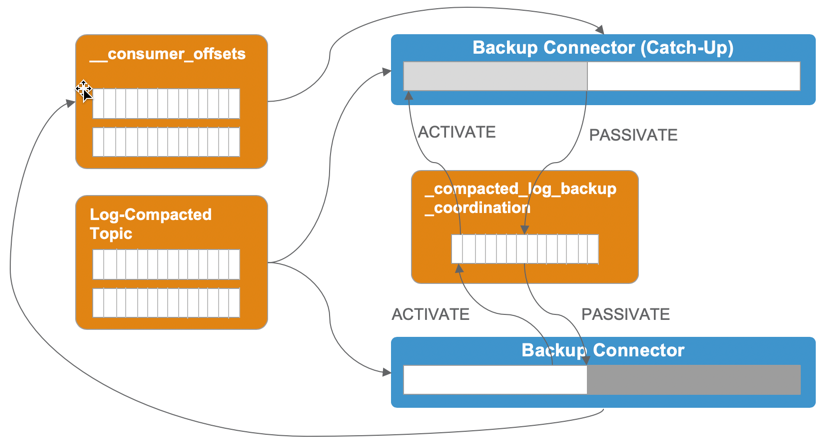
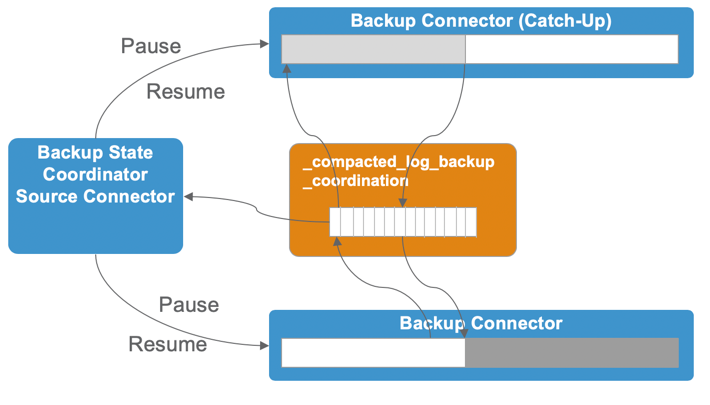

## Backup of Compacted Log Topics

The idea of the backup of compacted log topics is that a backup is always starting from offset 0 and backups all the data into S3. Conceptually we will use an **Active/Passive** setup. There are always to identical instances ready for doing a backup, one in **Active** and one in **Passive** mode. In order to keep the size of the backup small, after some time, the active backup instance informs the one in passive state that is should take over the work. The passive instance will start its backup (again from offset 0) and as soon as it reaches the end of the topic, it will switch to **active state** and inform the previous active one to change itself to passive state. Upon changing to passive state, the instance will remove its backup data on S3.  

The following diagram shows the two backup instances running for a Log Compacted Topics. 

The following steps describe one cycle of the backup and the switch from **Active** to **Passive**

 1. one instance starts in **Active** (white background) 
 2. and one instance starts in **Passive** state (grey background)
 3. the active instance starts its backup from offset 0 
 4. the backup runs until a configurable time has passed (`compacted.log.backup.length.days`)
 5. the active instance publishes a message to topic `_compacted_log_backup_coordination` according to this [Avro Schema](../src/main/avro/AvroCompatedLogBackupCoordination-v1.0.avsc)
 6. the Passive instance picks up the message and changes its state to **Catch-up**
 7. clears its backup destination on S3 
 8. and (re)starts its own backup from offset 0
 9. if the passive instance is at the end of the topic, it sends another message to `_compacted_log_backup_coordination`, this time to inform the Active instance to switch into **Passive** state
 10. The Active instance consumes the message 
 11. clear its backup destination on S3
 12. and changes its state to **Passive**
 13. the Passive instances changes its state to **Active** while continuing backing up the data

Now the circle restarts with the roles (**Active** and **Passive**) switched.

The following diagram shows the usage of the coordination topic in more detail. 

In order to keep the solution simple at the beginning, we could always start twpo instances of backup with identical configuration, except that one would start-up in **Passive** and one in **Active** state. 

Option questions and possible solutions

  1. What does **Active** and **Passive** mode mean in the context of a Kafka Connector?
    
     * we could use the **Pause** and **Resume** commands of a connector to match **Passive** and **Active** modes. A connector which is paused will no longer receive messages from the Connector. There are two corresponding methods `pause` and `resume` on the `SinkTaskContext` class (an instance of this class being available inside the connector)	
  2. How to start a backup from the beginning, if a connector was already running
    
     * use the [`offset`](http://raovat2.champhay.com/apache/kafka/2.2.1/javadoc/org/apache/kafka/connect/sink/SinkTaskContext.html#offset-java.util.Map) method on the `SinkTaskContext` class before switching the connector back to **Active**

  3. Is a connector in **Passive** state able to consume a message from Kafka, assuming that the connector instance has been **Paused**?
    
     * if this is not possible, then an option would be to implement a special Kafka Source Connector, which just reads the topic  `_compacted_log_backup_coordination` as well and executes the **Pause** and **Resume** command accordingly.

 		

  4. How do we know that we are at the end of the Topic, when we are "catching-up" in order to get the **Active** instance?
    
     * currently the only option I see is to also consume the `__consumer_offsets` topic and filter for the connector consumer instance which is currently active. This is shown in the diagram above as well.