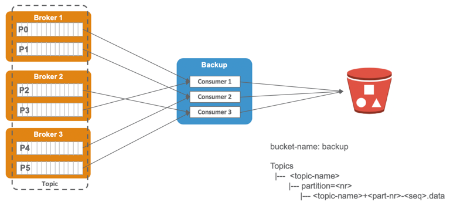
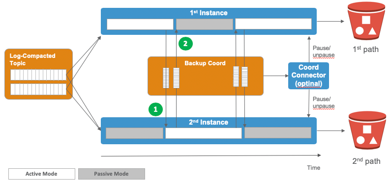
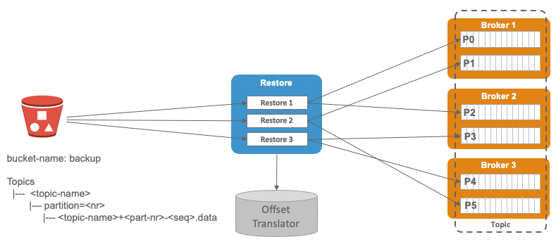

# Backup

The backup can be started on a topic base and will consume all the partitions of the topic to be backed-up and write it to a bucket in object storage. The following diagram shows the schematics of the Backup solution:



We will also backup some of the internal topics

* `__consumer_offsets` - this is the topic where the consumer commits its offsets by default. We have to backup this topic not really to be able to restore it, but to be able to do the offset translation upon restore. The backup is needed because a deletion of a "normal" topic through Kafka Admin will write a record with a NULL value to this topic, which will remove the offsets for that topic upon the next compaction cycle ([Issue 15](https://github.com/TrivadisPF/kafka-backup/issues/15))
* `_schemas` - 

## Serialisation

Each record from Kafka is written to the Backup serialised as an Avro Record in the following format:

```
{
  "namespace": "ch.tbd.kafka.backuprestore.model.avro",
  "type": "record",
  "name": "AvroKafkaRecord",
  "fields" : [
    {"name": "topic", "type": "string"},
    {"name": "partition", "type": "int"},
    {"name": "offset", "type": "long"},
    {"name": "timestamp", "type": "long"},
    {"name": "key", "type": [ "bytes", "null" ], "default": "null" },
    {"name": "value", "type": "bytes"},
    {"name": "headers", "type": [ {"type": "map", "values": "bytes"}, "null" ], "default": null}
  ]
}
```

We decided to use Avro because it will simplify serialisation, as it will all be done by Avro. We can also assume that we can easily guarantee that the data can be restored later, even if in the future we would for some reason decide to change the backup record.

The data in the Avro object contains the following information. When we talk about original Kafka record we mean the Kafka record which as been consumed by the backup process and is being backed up to Object storage.

* `topic` - the topic this backed-up Avro record belongs to
* `partition` - the partition of the topic this backed-up Avro record belongs to
* `offset` - the offset of record in the original topic
* `timestamp` - the value of the timestamp from the original Kafka record.
* `key` - the content of the key from the original Kafka record as a sequence of 8-bit unsigned bytes
* `value` - the content of the value from the original Kafka record as a sequence of 8-bit unsigned bytes
* `headers` - all the headers from the original Kafka record as a Map. The key of the map is a string (which is the name of the header) and the maps value is serialized as a sequence of 8-bit unsigned bytes

## Organisation in Object Storage

The data has to be partitioned in Object Storage in a way that the original partitioning from the topic is preserved.

```
topics
|--- <topic-name>
     |--- partition=<nr>
          |--- <topic-name>+<part-nr>-<seq>.data
```


## Data Retention on Backup

The data in the backup should not be kept much longer than the data-retention on the Kafka topic. If the Kafka topic is 

### Time-based Retention

Time-based retention removes "old" data based on the timestamp of a non-active segment (Kafka log file). Active segments are never checked for removal. If a segment is not closed before the data retention is over, the data will be kept longer than the data retention. 

**Idea:** When we write the buckets, we set the metadata of the last message written. 

With the backup we guarantee that the backup holds data as long as the data retention on the Kafka topic. 
### Size-based Retention

Size-based retention removes "old" data based on size of the topic.

The size-based retention **is currently not supported** by the Kafka backup. It will later be added.

### Compacted Log Topics

If a topic is a so-called "compacted log" topic, then data is deleted based on keys so that only the latest info per key is kept.

In such a case we cannot remove data in the same way as for the size- and time-based topics.

[Issue #30](https://github.com/TrivadisPF/kafka-backup/issues/30) describes two possible issues we discussed. In here only the final solution is documented. 

The following diagram shows the two backup instances running for a Log Compacted Topics. 




# Restore



